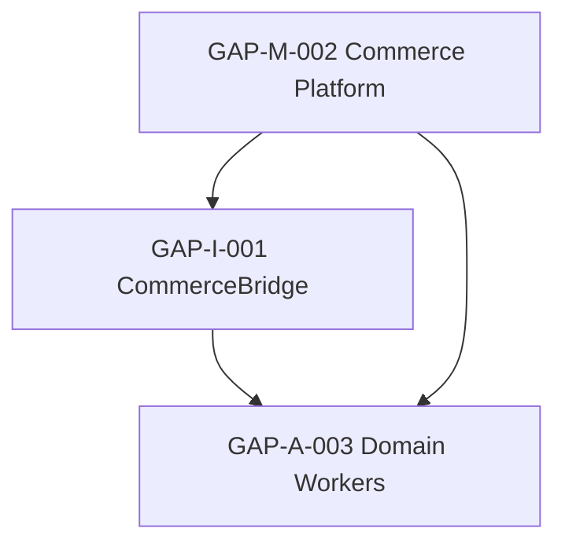

# BUZZARD AI CORE — PHASE 2 COMMERCE API EXTERNAL DEPENDENCIES

**Date:** 2026-08-22  
**Branch:** `cursor/phase2-p2-remediation-c293`  
**Method:** Code inspection of `ai_core/bridge/`, `ai_core/integrations/`, domain workers, and configuration — **no mocks, no simulated commerce data**

---

## Executive Summary

Three P1 findings (GAP-A-003, GAP-I-001, GAP-M-002) share a single root cause: **no live Buzzard Commerce API is provisioned in this environment**. Local code is implemented as an honest scaffold with `NO_DATA_AVAILABLE` / `EXTERNAL_INTEGRATION_PENDING` responses. These cannot be marked FIXED without a real external commerce platform connection.

| Gap ID | Classification | Blocks PHASE2_READY? |
|--------|----------------|----------------------|
| GAP-A-003 | EXTERNAL_DEPENDENCY | Yes |
| GAP-I-001 | READY_FOR_INTEGRATION | Yes |
| GAP-M-002 | BLOCKED | Yes |

---

## GAP-A-003 — Domain workers cannot produce live commerce outcomes

### Exact requirement
Domain workers (`supplier-hub`, `product-intelligence`, `price-engine`, `stock-engine`, `order-engine`) must return structured commerce intelligence from live supplier feeds, PIM, WMS, and order systems per `PHASE2_WORKER_SPEC.md`.

### Missing external dependency
- Live **Buzzard Commerce Platform** (product catalog, pricing, stock, orders)
- Live **supplier feed** integration (`supplier_feeds` status must be `CONNECTED`)
- Live **WMS** integration for stock sync

### Already implemented locally
| Component | Evidence |
|-----------|----------|
| Worker scaffolds | `ai_core/workers/supplier/hub_worker.py`, `product/`, `price/`, `stock/`, `order/` |
| Honest failure | Returns `EXTERNAL_INTEGRATION_PENDING` / `NO_DATA_AVAILABLE` — never fake success |
| Domain memory namespaces | Workers emit `memory_entries` to `suppliers/`, `products/`, `pricing/`, `stock/`, `orders/` |
| Orchestrator persistence | `_persist_worker_memory_entries()` writes domain memory on success **and** failure |
| Integration registry | `IntegrationStatusRegistry` tracks `commerce`, `supplier_feeds`, `wms` |
| Tests | `test_domain_worker_honest_external_status`, `test_domain_worker_writes_supplier_memory_on_external_pending` |

### Cannot verify without external API
- Real product enrichment from PIM
- Live price recheck from commerce DB
- Stock levels from WMS
- Order lifecycle anomalies
- Supplier feed ingestion outcomes

### Integration point
```
Domain Worker → CommerceBridge.read_*() → Commerce HTTP adapter
              → IntegrationStatusRegistry.status("supplier_feeds"|"wms"|"commerce")
```

### Required credentials / configuration
| Variable | Purpose |
|----------|---------|
| `COMMERCE_API_URL` | Base URL for Buzzard commerce read/write API |
| `COMMERCE_API_TOKEN` | Bearer token for commerce API |
| Supplier feed credentials | TBD per supplier integration spec |
| WMS endpoint credentials | TBD per WMS integration spec |

### Required external API capabilities
- `GET /products`, `GET /products/{sku}`
- `GET /orders`, `GET /orders/{id}`
- `GET /stock`, `GET /stock/{sku}`
- Supplier feed status endpoint
- WMS inventory sync endpoint

### Truly external?
**YES** — domain workers are implemented; outcomes require live commerce data that does not exist in this repository or test environment.

### Classification
**EXTERNAL_DEPENDENCY**

---

## GAP-I-001 — CommerceBridge read path not connected

### Exact requirement
`CommerceBridge` read methods must return live commerce records when the platform is connected (`PHASE2_COMMERCE_BRIDGE_SPEC.md` Step 13).

### Missing external dependency
- Provisioned `COMMERCE_API_URL` + `COMMERCE_API_TOKEN` pointing to a live Buzzard commerce deployment

### Already implemented locally
| Component | Evidence |
|-----------|----------|
| Bridge module | `ai_core/bridge/commerce.py` |
| HTTP adapter scaffold | `CommerceBridge._request()` uses real `urllib` when configured |
| Honest unconfigured state | Returns `NO_DATA_AVAILABLE` when env vars absent |
| Worker consumption | Product, price, stock, order workers call bridge |
| Tests | `test_commerce_bridge_returns_no_data_not_fake`, `test_commerce_write_requires_approval_and_external_integration` |

### Cannot verify without external API
- Successful read responses with real SKU/order data
- Integration health transition to `CONNECTED`
- End-to-end domain worker success via bridge reads

### Integration point
```
ai_core/bridge/commerce.py → CommerceBridge
  ├── read_products(sku?)
  ├── read_orders(order_id?)
  └── read_stock(sku?)
```

### Required credentials / configuration
| Variable | Default | Required |
|----------|---------|----------|
| `COMMERCE_API_URL` | `""` (empty) | Yes — base URL |
| `COMMERCE_API_TOKEN` | `""` (empty) | Yes — bearer token |
| `REQUEST_TIMEOUT` | `15` | Optional |

### Required external API capabilities
REST JSON API with product, order, and stock resources (see commerce bridge spec).

### Truly external?
**YES** for live data; **NO** for adapter code — adapter is implemented and awaits configuration.

### Classification
**READY_FOR_INTEGRATION** (cannot mark FIXED until live API is connected and verified)

---

## GAP-M-002 — Commerce platform integration not provisioned

### Exact requirement
All commerce-related integrations must transition from `EXTERNAL_INTEGRATION_PENDING` to `CONNECTED` with durable health tracking (`PHASE2_IMPLEMENTATION_PLAN.md` Step 13).

### Missing external dependency
- Buzzard commerce platform deployment (Render/production)
- Supplier feed endpoints
- WMS system
- CRM connector (for customer-service domain)
- Operations team to provision and monitor integrations

### Already implemented locally
| Component | Evidence |
|-----------|----------|
| Integration registry | `ai_core/integrations/registry.py` — static honest pending map |
| DB persistence service | `IntegrationStatusService` syncs status to `ai_core_integration_status` |
| API endpoint | `GET /api/v1/integrations/status` |
| Scheduler polling | Orchestrator `_sync_phase2_metadata()` updates integration rows |
| Tests | `test_integrations_status`, `test_integration_status_persisted` |

### Cannot verify without external API
- `CONNECTED` status for commerce/supplier_feeds/wms
- Last-checked timestamps reflecting real health probes
- Domain worker success rates against live data

### Integration point
```
IntegrationStatusRegistry → IntegrationStatusService → ai_core_integration_status table
                         → /api/v1/integrations/status
                         → Domain workers check status before execution
```

### Required credentials / configuration
Per-integration credentials (commerce API, supplier feeds, WMS, CRM) — none provisioned in current `config/settings.py` beyond `COMMERCE_API_*` placeholders.

### Required external API capabilities
Full commerce platform: catalog, orders, inventory, supplier feeds, customs data feeds.

### Truly external?
**YES** — requires platform team to provision and connect external systems.

### Classification
**BLOCKED** (blocked on external platform provisioning; local code cannot unblock)

---

## Dependency Chain



GAP-M-002 must be resolved first (platform provisioned), then GAP-I-001 (bridge connected), then GAP-A-003 (domain outcomes verified).

---

## What Would Change STATUS to PHASE2_READY

1. Provision live Buzzard Commerce API with documented endpoints
2. Set `COMMERCE_API_URL` + `COMMERCE_API_TOKEN` in production environment
3. Connect supplier feeds and WMS — integration status → `CONNECTED`
4. Re-run domain worker E2E tests with live data (no mocks)
5. Independent verification that all three P1 gaps are FIXED

Until then, all three remain **honestly classified as external** and STATUS stays `PHASE2_PARTIAL`.

---

*No architecture redesign performed. No fake commerce data introduced.*
