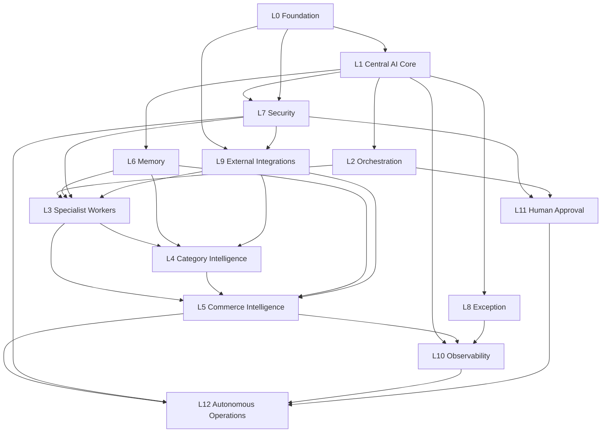

# BUZZARD AI CORE — PHASE 3 DEPENDENCY MAP

**Version:** 1.0  
**Date:** 2026-08-22

---

## 1. Layer Dependency Graph



**Rule:** Dependencies flow downward only. No layer may depend on a layer above it.

---

## 2. Module Dependency Matrix

| Module | Depends On | Depended On By |
|--------|------------|----------------|
| PostgreSQL / Alembic | — | All persistence |
| Config / Settings | — | All modules |
| UnifiedOrchestrator | DB, Security, Memory, Exception, Audit | Workers, APIs, Decision Engine |
| WorkerRegistry | TaxonomyRegistry, Worker implementations | Orchestrator, Executor |
| WorkerExecutor | Registry, PolicyEngine | Orchestrator |
| CentralMemoryService | DB, PolicyEngine | Workers, Kurmay, Decision Engine |
| ExceptionService | DB, AssignmentRouter | Orchestrator, Workers |
| AuditService | DB | All write paths |
| SecurityService (EsatBey) | EsatBey agent | Orchestrator VALIDATING gate |
| PolicyEngine | Config roles | Executor, Memory, Approvals |
| TaxonomyRegistry | taxonomy.json | CategoryWorkerFactory, Categories API |
| CategoryWorkerFactory | TaxonomyRegistry | WorkerRegistry |
| CommerceBridge | HTTP client, config | Domain workers, Commerce adapter |
| IntegrationStatusRegistry | Adapters | IntegrationStatusService, Workers |
| KurmayRuleEngine | Memory, Exceptions | Kurmay worker, Decision Engine |
| Business Decision Engine (P3) | Memory, Workers, Integrations | Autonomous Action Engine, Kurmay |
| Autonomous Action Engine (P3) | Decision Engine, PolicyEngine, Approvals | Orchestrator task creation |
| Supplier Adapter Layer (P3) | Integration registry | supplier-hub, Product pipeline |
| Product Intelligence Pipeline (P3) | Supplier layer, Category Intel | product-intelligence worker |
| Pricing Intelligence Engine (P3) | Commerce bridge, Policy | price-engine worker |
| Stock Intelligence (P3) | WMS adapter, Commerce bridge | stock-engine worker |
| Order Intelligence (P3) | Commerce bridge, Stock | order-engine worker |
| Market Intelligence (P3) | Compliant external APIs | Decision Engine, Category workers |
| Carrier Abstraction (P3) | Integration registry | Logistics, Order fulfillment |
| Event Bus (P3) | DB event tables | All async integrations |
| JWT/RBAC (P3) | Config / IdP | All API endpoints |

---

## 3. External System Dependencies

| External System | Blocks | Phase 3 Module | Wave |
|-----------------|--------|----------------|------|
| Buzzard Commerce API | GAP-A-003, GAP-I-001, GAP-M-002 | Commerce Integration Layer | Wave 1 |
| Supplier feed endpoints | Supplier intelligence | Supplier Integration Layer | Wave 2 |
| WMS system | Stock sync | Stock Intelligence | Wave 2 |
| CRM system | Customer context | Customer Intelligence | Wave 3 |
| EU customs API | HS classification | customs-classifier | Wave 3 |
| LLM provider (production) | Customer service drafts | LlmProviderAdapter | Wave 1 |
| Storefront catalog | GAP-M-003 | Storefront taxonomy bridge | Wave 2 |
| Carrier APIs (DHL, DPD, etc.) | Logistics | Carrier Abstraction | Wave 3–4 |
| Compliant market data APIs | Market intelligence | Market Intelligence Layer | Wave 4 |
| Identity provider (JWT) | Production auth | JWT/RBAC | Wave 1 |

---

## 4. Data Flow Dependencies

```
External Data → Integration Adapter → Normalizer → Validator → Mapper
    → Worker → Memory → Kurmay / Decision Engine
    → Approval (if required) → Action → Audit
```

No worker may write to commerce systems without passing through:
1. PolicyEngine risk check
2. Approval gate (if HIGH/CRITICAL or policy requires)
3. CommerceBridge or domain adapter
4. AuditService record

---

## 5. Circular Dependency Check

| Potential Cycle | Resolution |
|-----------------|------------|
| Decision Engine → Worker → Decision Engine | Workers emit signals; Decision Engine creates tasks — unidirectional via event bus |
| Kurmay → Decision Engine → Kurmay | Kurmay reads memory; Decision Engine writes decisions namespace — no cycle |
| Approval → Orchestrator → Approval | Approval is a task transition, not a separate orchestrator — acyclic |
| Memory → Worker → Memory | Worker writes via orchestrator callback — no direct cycle |

**Result:** No circular dependencies identified.

---

## 6. Phase 1/2 Compatibility Dependencies

| Phase 3 Module | Phase 2 Interface | Compatibility |
|----------------|-------------------|---------------|
| Commerce Integration | `CommerceBridge` | Extend, do not replace |
| Supplier Integration | `supplier-hub` worker | Wire existing worker |
| New workers | `BuzzardWorker` base class | Subclass existing contract |
| New APIs | `/api/v1` router | Add sub-routers, no breaking changes |
| New DB tables | Alembic 008+ | Additive only |
| New task types | `WORKER_ROUTING` | Add entries, preserve existing |
| Memory namespaces | `CentralMemoryService` | Add namespaces, preserve existing |
| Feature flag | `BUZZARD_AI_CORE_V2` | V3 modules gated behind `BUZZARD_AI_CORE_V3` |

---

## 7. Critical Path

```
Wave 1: JWT/RBAC + CommerceIntegrationAdapter + CommerceBridge live wiring
    ↓
Wave 2: Supplier Adapter Layer + Product Pipeline + Storefront bridge
    ↓
Wave 3: Pricing/Stock/Order intelligence + Business Decision Engine
    ↓
Wave 4: Logistics + Returns + Market Intelligence + Observability
    ↓
Wave 5: Autonomous Action Engine L3 + Demand Forecasting (future)
```

No wave may start until its dependencies are defined and prior wave acceptance criteria met.
